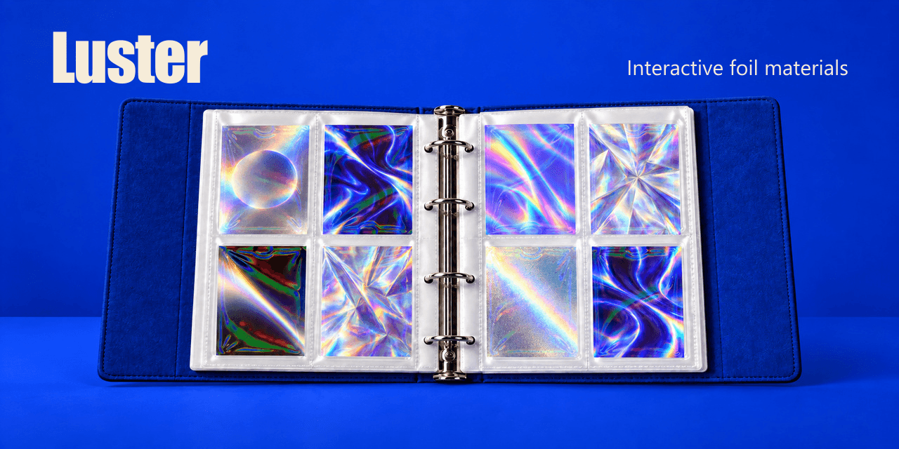
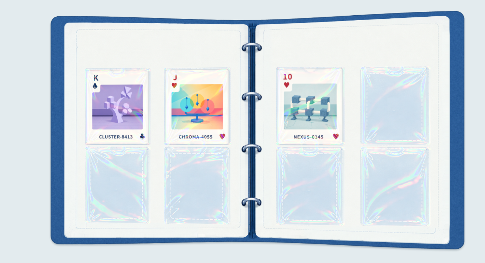

# Luster

[简体中文](README.zh-CN.md)

A reusable WebGL foil material that adds angle-dependent iridescent highlights to images.



## Try it

Requires Python 3 and a browser with WebGL 1 and `OES_standard_derivatives`. From the repository root:

```sh
python -m http.server 8798 --bind 127.0.0.1
```

Open [localhost:8798](http://127.0.0.1:8798). Move the pointer to tilt the book, switch between B14/B11 presets, or explore individual materials and optical controls.



## Integrate

Serve `src/` with your application. Supply a canvas, decoded image and packed normal bytes (`Uint8Array`):

```js
import { FoilRenderer } from './src/index.js';

const material = await FoilRenderer.create(canvas, {
  normal: { data: packedRGBABytes, width: 512, height: 512 },
  background: decodedImage,
});
material.render({ angle: -4 }); // degrees; call again when the angle changes
material.dispose(); // when finished
```

[Integration guide](docs/guide.md) · [Normal format](docs/textures.md) · [Architecture](docs/architecture.md) · [Tests and compatibility](docs/verification.md)

## Status and license

An art-directed spectral approximation for material experiments and interactive displays. See the verification notes for compatibility and performance limits.

No open-source license is currently included. See [asset permissions](docs/assets.md) before reusing the sample artwork.
