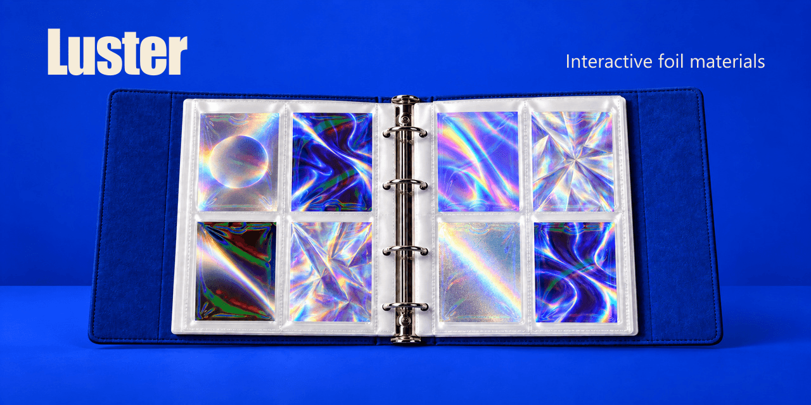

# Luster

[English](README.md)

基于 WebGL 的交互式卡面与薄膜材质，呈现随角度和光照变化的镭射反光。



[在线试用](https://luster.onovich.com/) · [材质展示](https://luster.onovich.com/showcase/) · [接入指南](docs/guide.zh-CN.md) · [卡面材质](docs/card-materials.md)

纯网页版 Trial 已开放：上传作品或使用内置示例，探索材质并下载最长边 512px 的免费无水印 PNG。Pro 正在开发中，未包含在公开站点内。参见[网页版工作台状态](docs/online-workbench.md)。

在卡册或单卡视图中体验八种卡面，开关薄膜，调节角度、光向与反光强度。

## 本地运行

需要 Python 3，以及支持 WebGL 1 和 `OES_standard_derivatives` 的浏览器。

```sh
python -m http.server 8798 --bind 127.0.0.1
```

打开 [localhost:8798](http://127.0.0.1:8798)。

面向视觉表现的实验项目。仓库尚未提供开源许可证；复用美术前，请查阅[素材授权说明](docs/assets.md)。
