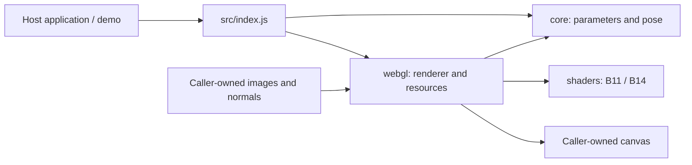

# Architecture

Luster is a small material library with a standalone visual laboratory. Keep native ES modules and static HTTP delivery until a concrete consumer requires packaging or a framework adapter.

## Dependency direction

`src/` never imports `demo/`, `tests/` or `docs/`. The host owns content, geometry, interaction and the frame loop. The renderer owns its WebGL resources and draws only when asked.

## Directory contract

| Path | Responsibility |
| --- | --- |
| `index.html` | Static demo entry point |
| `src/index.js` | Public imports: renderer, presets, parameter validation and optional pose tween |
| `src/core/` | Immutable presets, units, validation and pure interruptible quintic interpolation |
| `src/shaders/` | Spectral equations and composition; no business state or time-driven texture motion |
| `src/webgl/` | Shader loading, GPU resources, texture upload and explicit rendering/disposal |
| `demo/` | Book/material views, controls, pointer and keyboard presentation |
| `demo/assets/images/` | Replaceable example artwork |
| `demo/assets/normals/` | Packed normal bytes, independent of image decoding |
| `tests/fixtures/approved/` | Public optical baselines, presets, atlas and minimal reference runners |
| `tests/support/` | Configurable browser launch support |
| `tools/` | Reproducible visual capture tooling |
| `docs/screenshots/` | Selected runtime evidence |
| `docs/validation/` | Small checked-in verification reports |
| `docs/` | Integration, naming, architecture, privacy and editable cover |

Generated test output belongs in `.test-output/`. Local source evidence belongs in ignored `.local/`; neither is part of the published project.

## Interfaces and ownership

- Inputs: decoded base image, XY16 normal bytes and dimensions, angle in degrees, material parameters.
- Output: opaque composited canvas. The reflection inspection mode is diagnostic, not a transparent overlay API.
- `FoilRenderer.create()` loads the selected shader. Updates are explicit through `setParameters`, `setNormal`, `setBackground`, `resize` and `render`; `dispose` releases resources.
- `PoseTween` is optional. A host can supply any continuous angle without adopting the demo's ±4° interaction.
- A shader change must pass optical comparison; a demo change must pass interaction and layout checks. New business concepts belong in the consuming application.

## Public regression boundary

The original reference pages contained unrelated application presentation. Their untouched originals are retained locally. Public fixtures preserve the original shader files, preset JSON and normal atlas byte for byte, with extracted reference WebGL routines and a minimal runner. They load the permitted demo assets, contain no embedded application screenshot, and do not import the current renderer. Hashes lock this new public fixture set; they are not presented as hashes of the original HTML.

Both the public fixtures and the local originals were checked against the current renderer at publication. Public tests remain runnable without private evidence.

## Extension plan

1. Keep adapters outside `core`: a React wrapper or another host should own canvas lifecycle and input decoding.
2. Add another renderer backend only when needed; share parameter semantics and normal contracts, and retain backend-specific shaders and resources.
3. For many instances, introduce a shared-context renderer with atlas/viewport management after profiling. Eight demo contexts are not a production scaling strategy.
4. Add packaging, TypeScript declarations or a build system when an actual distribution requirement justifies them. They are not current features.
